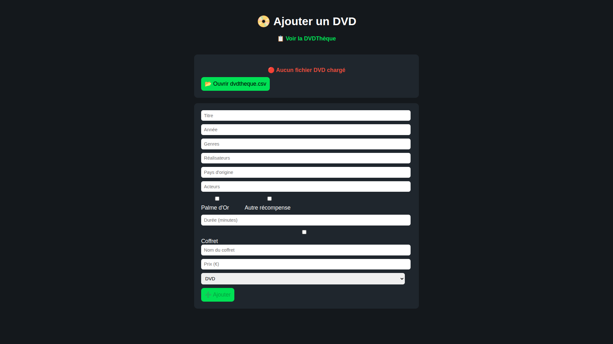
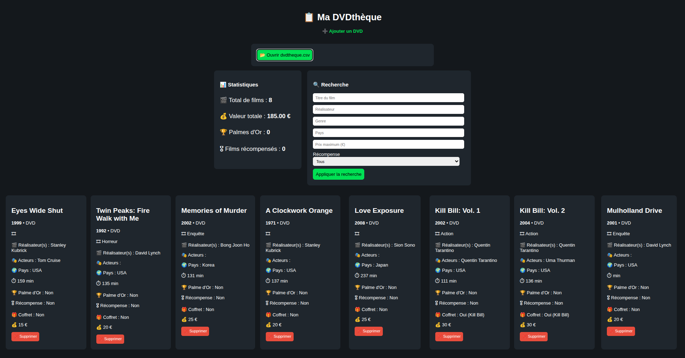

**Language : HTML/CSS/JavaScript**  
**Status : Complete**  
**Software Version : 1.0**  

---
### *Description* :   
A web app to manage and visualize the state of your DVD colection.   
   
---
### *How to use* :   
- First download the project to use it locally.
- Open the **ajout.html** file in your browser and upload the **dvdtheque.csv** file now you can fill the data from your colection.
- Then you can see, browse and search throughout your DVD library with the **visualisation.html** file and the search tool.
  
---
### *Visual* :

   
   
   

   
---
